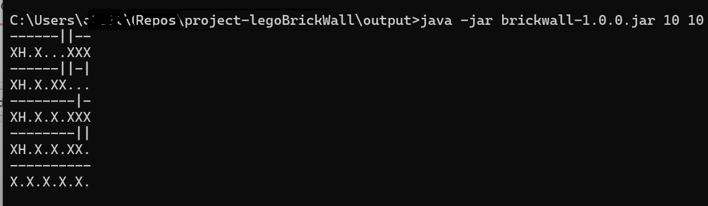

# project-legoBrickWall

## Steps to build the Code
 
* Make sure jdk and maven is installed and configured in your system.
* Clone the repository project-legoBrickWall to your local system.
* Open a command window and navigate to the directory "project-legoBrickWall/brickwall".
* Run the below command to build package
```bash
mvn clean install
```
* jar "brickwall-{version}.jar" file will be created under the folder "project-legoBrickWall/output"

## Steps to execute the program

* Open command window and navigate to the directory "project-legoBrickWall/output".
* Run the below command to execute the package
```bash
java -jar brickwall-1.0.0.jar [wall height] [wall width]

```
where, </br>
  wall height is the number of layers in the wall</br>
  wall width is the width of the wall.

### Sample 
Refer the below screenshot to see program execution


In the above image a lego brick wall of height 10 and width 10 is generated. Here a brick is represented by a '|' or '–' and '.' or 'X' (every alternate layer).
Holes between the wall are represented by a 'H'

